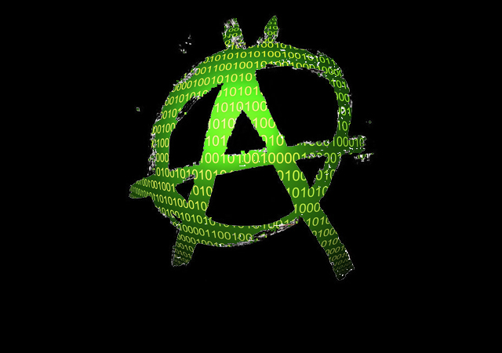
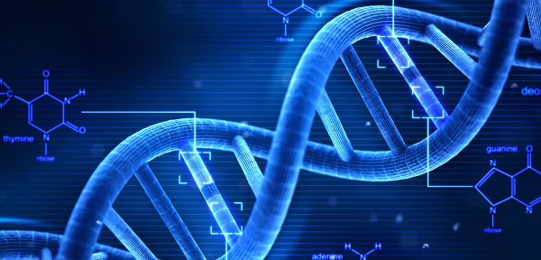
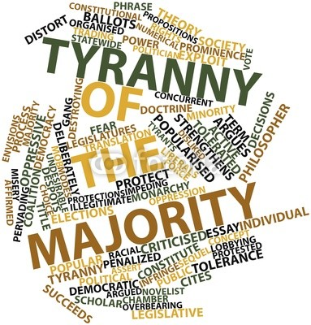
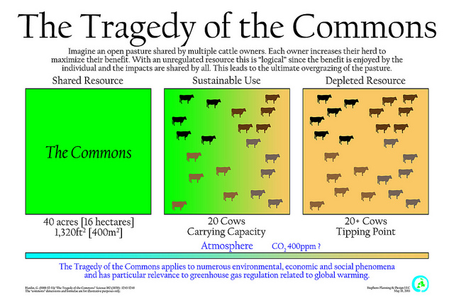

Methodology for reaching improved governance of decentralized anarchist organizations

Figure 1 - Source [Inside Bitcoins](http://insidebitcoins.com/)

## Introduction

One of the main problems to be addressed by a decentralized anarchist organization of individuals is the intelligent allocation of resources. As each individual is motivated to propose organizational improvements, for each opportunity the organization has, several proposals might be sent for evaluation of the decision taking board. It's probable that not all the proposals made are going to be funded because resources (matter, time, space, intelligent agents) are limited. So methods for selecting most fit proposals are often utilized. Here I present a method analogous to the genetic algorithm for selecting most fit proposals to be funded within an anarchist organization.

Figure 2 - Source [Mile Track GPS](https://miletrackgps.com/)

## Proposed Algorithm

A population of proposals to a problem is evolved toward better proposals. The evolution starts from a population of community generated proposals, and is an iterative process, with the population in each iteration called a generation of proposals. In each generation, the fitness of every proposal in the population is evaluated; The more fit proposals are selected from the current population, and each proposal details are modified to form a new generation. The new generation of candidate proposals is then used in the next iteration of the proposals algorithm. Commonly, the algorithm terminates when either a maximum number of generations has been produced, or a satisfactory fitness level has been reached for the population.

## Measuring Fitness Of Each Proposal

One way to effectively measure the fitness of proposals is by a simple democracy voting process. The problem with this method is that receiving bad votes can lead to the tiranny of the majority.

Figure 3 - Source [FTCDN](http://t1.ftcdn.net/)

If somehow a method for measuring the quality of the votes was available, the [tiranny of the majority](https://en.wikipedia.org/wiki/Tyranny_of_the_majority) could be avoided.

## Measuring Quality of Votes

The quality of the votes can be estimated with the conscience level each voter has.

Figure 4 - Source [My Tech Analyst](http://www.mytechanalyst.net/)

To better illustrate the conscience level parameter I'll give a classical example called [tragedy of the commons](https://en.wikipedia.org/wiki/Tragedy_of_the_commons).

## Tragedy of the Commons

>The tragedy of the commons is an economic theory of a situation within a shared-resource system where individual users acting independently according to their own self-interest behave contrary to the common good of all users by depleting that resource through their collective action.

Figure 5 - Source [Jborden](http://www.jborden.com/)

People with less conscience would vote based on their own interest resulting in the depleting of the common resource whereas people with more conscience would actually vote for the collective handling of the common resource for added overall productivity.

If each individual has one vote, and 80% of the individuals are not conscious, full democracy would probably lead to depleting that resource. Let's then imagine a system that will give 5 votes for each individual that passes the courses called Tragedy Of The Commons and Correct Handling Of The Common Resource.

## Star Wars Analogy

In Star Wars the consciousness level would be something like the [Midichlorian count](http://starwars.wikia.com/wiki/Midi-chlorian). The highest Midichlorian count is attributed in the series to [Anakin Skywalker](http://starwars.wikia.com/wiki/Anakin_Skywalker), above 20,000.

He became Darth Vader and started acting evilly, in the same way highly conscious individuals often do. This indicates that consciousness cannot be the only factor for and individual to receive voting power. Instead evilness has also to be considered.Recently BBC published a psychological test called "[How dark is your personality](http://www.bbc.com/future/story/20151123-how-dark-is-your-personality)" to measure evilness.

Figure 6 - Source [Tumblr](https://www.tumblr.com/)

Evilness can be modeled as a factor ranging from -1 to 1.
 To be fair with the community evolution:

Voting power of an individual = - Evilness * Consciousness Level.

Instead of a general consciousness level, people are often very conscious in one subject and unconscious in another. That means the consciousness level in the equation above, that gives an individual voting power, has to be about the subject being voted, i.e. the proposals population and the problem to be addressed.

Let's then imagine a system that will give 5 votes for each individual that passes the courses called Tragedy Of The Commons and Correct Handling Of The Common Resource.

These courses are in fact relevant competences to the subject being voted, so an increase of these competences is positively related with a better vote.

### Measuring evilness of an individual

Figure 6 - Source the author

The advent of the blockchain allowed the recording of information in a safe, decentralized and possibly immutable way. Taking into advantage this technology, the evil deeds of an individual can be recorded in a blockchain powered immutable ledger.

If that was done in the [forked Ethereum](https://www.ethereum.org/), Darth Vader would have the possibility to attack his evilness ledger to make it not evil with the purpose of receiving voting power.

## Drawbacks

This system might look overly complicated for a project selection process. Although with the advent of the [smart contracts](http://szabo.best.vwh.net/smart_contracts_idea.html) and computerized selection processes, the burden part of the process can be computer aided. After a few rounds people should get used to it.

## Insights

This topic was motivated from my participation in the [Ethereum Classic](https://ethereumclassic.org/) community and first posted at [Github - issue 39](https://github.com/ethereumclassic/README/issues/39). Thank you Avtar Sehra for your contribution.