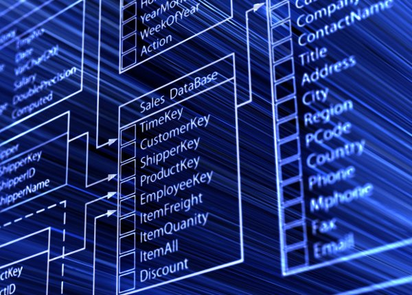
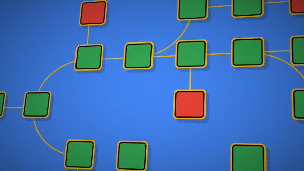
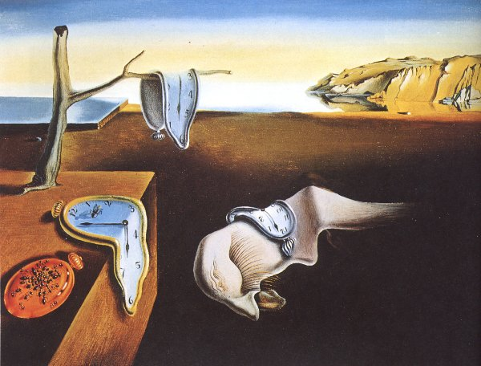

I will explain the basics, and weirdness, of blockchains.

# Databases

Database administration is difficult.  Information may be lost due to computer or human errors and corruption.  In 2014, half a *billion* Yahoo accounts were compromised.  Just a few months ago, the Air Force lost 12 *years* of investigative records.  Therefore, it continues to be problematic to trust companies and governments with information.

# Blockchains

Blockchains are decentralized, secure, reliable and convenient databases.  Nobody trusts anybody and no one is in charge.  Nevertheless, blockchains are still used to store valuable assets including life savings and land titles.

Blockchain asset information is stored in records referred to as *transactions*.  Transactions are organized into *blocks* which are further organized into *chains*.  Cryptographic tools such as hashing functions and digital signatures help provide security.  For additional security, to add new blocks, people must compute results referred to as *proof of work information*.  To encourage this, calculation of proof of work information leads to cryptocurrency rewards.  People that compete to compute proof of work information, and receive cryptocurrency rewards, are referred to as *miners*.

# A Weird Analog

For an analog to blockchain systems, consider free market economies.  In free markets, goods and services are not in general managed by *anyone*.  Like blockchain systems, they are decentralized.  Interestingly, free market economies work better than controlled economies.  Adam Smith noticed, over 200 years ago, that individuals pursuing their own interests often benefit society more so than if they intentionally tried to benefit society.  It is as if every man is, in the words of Adam Smith, "led by an invisible hand to promote an end which was no part of his intention. Nor is it always the worse for the society that it was no part of it. By pursuing his own interest he frequently promotes that of the society more effectually than when he really intends to promote it."  Likewise, unmanaged blockchain systems work better than managed database systems for some applications.

# Competition Is Foundational

Free market economies work so well largely because of competition.  Competition improves productivity, efficiency, quality and more.  Likewise, competition is foundational to blockchain systems.  Widespread competition in mining provides resilience and security.  Free market economies are threatened when competition is dimished, such as when monopolies form.  Blockchain systems are threatened when a miner controls a majority of the mining resources (51% attack).

# Conclusion

Blockchain systems are able to effectively manage information in a trustless manner.  They do this partly by utilizing the power of competition.  If blockchains seem unbelievable, consider that many are *still* skeptical of  free markets for similar reasons.  In the words of Mark Twain:

"Truth is stranger than fiction."

# Feedback

You can contact me by clicking any of these icons:

  

# Acknowledgements

I would like to thank IOHK (Input Output Hong Kong) for funding this effort.

# License

This work is licensed under the Creative Commons Attribution ShareAlike 4.0 International License.
