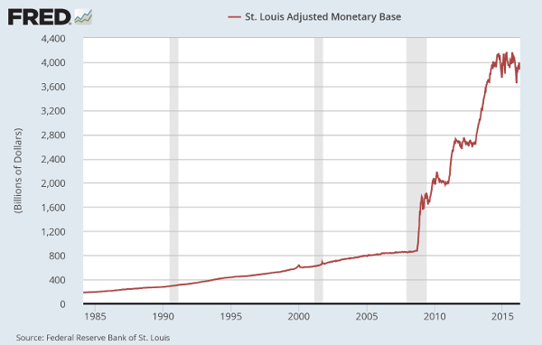

I will discuss money and monetary policy as well as give details regarding cryptocurrencies.

# What Is Money?

No one can create all the products and services they desire.  Therefore, people *exchange* products and services.   Money is an object that facilitates this exchange.  Examples of money include convenient products such as rice and salt.  More abstract examples of money include promissory notes like gold notes:

Another abstract example is a tally stick.  It can record economic transactions much like a blockchain:

The most abstract examples of money are not associated with *any* product or service, and, they have little or no intrinsic value.  An example is a dollar bill.  The only intrinsic value is the value of the paper and ink.  Another such example is a cryptocurrency key.  It is a set of random numbers with *no* intrinsic value!

Money facilitates *storage*.  It is more convenient to store dollar bills than say horses or eggs.  Money also facilitates *distribution*.  It is more convenient to send Bitcoin than say houses.  Money also facilitates *pricing*.  It is convenient to relate the values of all products and services to some single type of money.

# What Is Monetary Policy?

A monetary policy is a plan to manage a money *supply*.  Some advocate fixed money supplies.  Some advocate adjustable money supplies.  In response to the Great Recession, many governments greatly increased their money supplies:

Satoshi Nakamoto set up Bitcoin to have a *fixed* long term money supply.  He was likely concerned about the possibility of corruption otherwise.  He placed the following Easter egg in the first (genesis) Bitcoin block: "The Times 03/Jan/2009 Chancellor on brink of second bailout for banks".  This refers to the following newspaper cover:

# What Sets Cryptocurrency Prices?

Cryptocurrency prices in general are not static.  Satoshi Nakamoto avoided a central bank and accepted potentially fluctuating Bitcoin prices:

> **Satoshi Nakamoto 2009-02-18 20:50:00 UTC**:
>
> **"You could say coins are issued by the majority. They are issued in a limited, predetermined amount... there is nobody to act as central bank... In this sense, it's more typical of a precious metal. Instead of the supply changing to keep the value the same, the supply is predetermined and the value changes."**

Arguments can be made that cryptocurrency prices vary as the mining difficulty, and, therefore the mining cost. Satoshi Nakamoto believed this was true for Bitcoin.  More people will presumably mine if that is cheaper than purchasing Bitcoin.  That will increase the mining difficulty thereby bringing the mining cost closer to the price. Conversely, *less* people will presumably mine if that is more expensive than purchasing Bitcoin.  That will *decrease* the mining difficulty thereby also bringing the mining cost closer to the price:

> **Satoshi Nakamoto 2010-02-21 05:44:24 UTC**:
>
> **"The price... tends to gravitate toward[s] the production cost.  If the price is below cost, then production slows down.  If the price is above cost, profit can be made by generating and selling more.  At the same time, the increased production would increase the difficulty, pushing the cost of generating towards the price. In later years, when new coin generation is a small percentage of the existing supply, market price will dictate the cost of production more than the other way around."**

In addition to mining difficulty, fluctuations in cryptocurrency demand can affect prices. Satoshi Nakamoto believed that Bitcoin economy growth could offset the inflationary effects of the (temporarily) growing money supply:

> **Satoshi Nakamoto 2008-11-08 16:38:26 UTC**:
>
> **"The fact that new coins are produced means the money supply increases by a planned amount, but this does not necessarily result in inflation. If the supply of money increases at the same rate that the number of people using it increases, prices remain stable. If it does not increase as fast as demand, there will be deflation and early holders of money will see its value increase."**

Furthermore, the *rate* of Bitcoin money supply growth is decreasing.  The money supply will never exceed 21 million BTC.  These attributes should help control inflation.  Satoshi Nakamoto believed lost Bitcoin would also help manage inflation due to the decrease of money in circulation:

> **Satoshi Nakamoto 2009-12-13 16:51:25 UTC**:
>
> **"[T]here will be natural deflation due to payment mistakes and lost data.  Coin creation will eventually get slow enough that... we'll have net deflation."**

Unlike Bitcoin, Ethereum and Ethereum Classic currently do not have fixed long term money supplies.  There are ongoing discussions in both communities about potential changes to their monetary policies.  Any modifications will also likely affect prices.

# Conclusion

Cryptocurrencies are innovative types of money with monetary policies that in general have strong protections against abuse.  Cryptocurrency prices can vary due to many factors.  As more people understand these technologies, hopefully they will gain the confidence to benefit from them.  In the words of the inventor of blockchains:

> **Satoshi Nakamoto 2008-11-14 17:29:22 UTC**:
>
> **"It's very attractive to the libertarian viewpoint if we can explain it properly."**

# Feedback

You can contact me by clicking any of these icons:

  

# Acknowledgements

I would like to thank IOHK (Input Output Hong Kong) for funding this effort.

# License

This work is licensed under the Creative Commons Attribution ShareAlike 4.0 International License.
