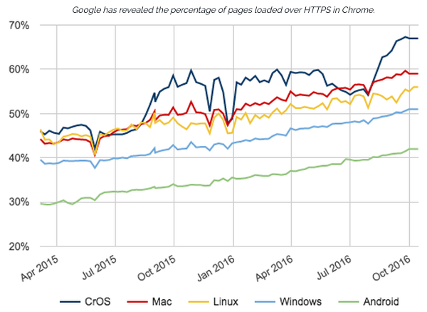
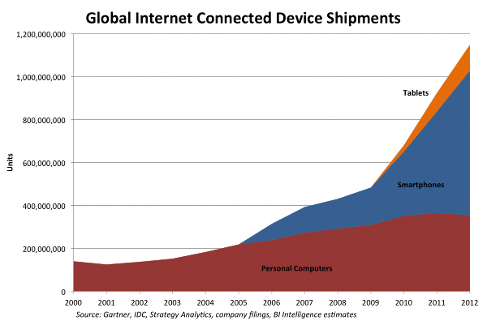
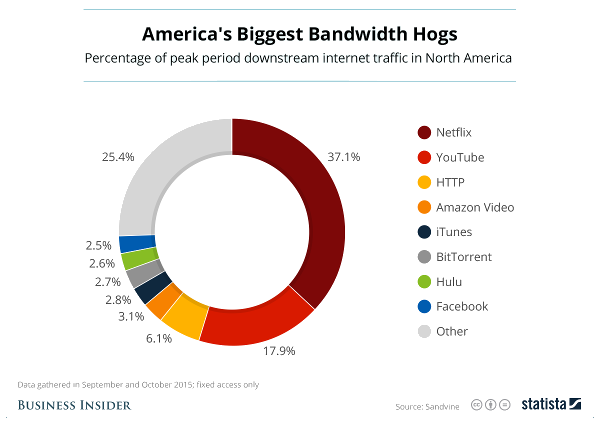

# Introduction

The Internet is amazing but it is not as good as it can be.  It is several decades old and was designed for a different environment.  It does not provide adequate protections and support for the ways people actually use it:

* **Security** - Security was *not* a major design goal of the Internet.  Data is vulnerable to hardware failures, censorship and attackers.  Even today tools like Secure Sockets Layer (SSL), Pretty Good Privacy (PGP) and Domain Name System Security Extensions (DNSSEC) are not widely used.  Security is *optional* :

* **Mobile Devices** - The Internet was designed to allow *static* computers to effectively communicate.  Movement requires new wireless connections to be constantly set up.  Furthermore, mobile device marketshare is *growing* :

* **Broadcasting** - The Internet was designed to allow *two* computers to effectively communicate.  That is great for tasks such as sending email.  However, today the majority of Internet traffic is *broadcasting*.  Examples include Netflix and YouTube videos:

# Glimpses Of A Better Internet

Virtual private networks (VPNs) and Tor provide better security.  Cell phone networks provide better support for mobile devices.  BitTorrent provides better support for broadcasting.  These give an idea of what a future improved Internet can look like.

# The InterPlanetary File System

The InterPlanetary File System (IPFS)  is one noteworthy attempt to replace the current Internet.  Security is built in by default.  BitTorrent like broadcasting gives it better performance.  Duplication of data across several computers provides censorship resistance and protection against hardware failures. There is even ongoing work to add support for mobile devices.

The Internet Protocol (IP) addresses devices.  A major change in IPFS, relative to the current Internet, is to focus on addressing *data*.  Notice that as long as copies of data are accurate, sources are *irrelevant*.  Furthermore, IPFS addresses are based on cryptographic hashes making information virtually impossible to tamper with.

# Blockchains

Blockchains are not designed to effectively store vast amounts of data.  This is why blockchain systems can greatly benefit from systems such as IPFS.  Imagine a video smart contract, on Ethereum or Ethereum Classic, for which it would be prohibitively expensive to store the required videos on the blockchain.  It would make much more sense to store the videos on IPFS and just store the corresponding IPFS *addresses* on the blockchain.

# Conclusion

There are efforts underway to greatly improve the Internet.  These efforts will make the Internet faster, more secure and more mobile friendly for all of us.  Blockchains will be able to effectively utilize these new architectures to allow the creation of many innovative applications in the near future.  Stay tuned as it should be a wild ride.

# Feedback

You can contact me by clicking any of these icons:

  

# Acknowledgements

I would like to thank Van Jacobson for his brilliant Named Data Networking related papers and talks that have greatly helped clarify many of these ideas.  I would also like to thank IOHK (Input Output Hong Kong) for funding this effort.

# License

This work is licensed under the Creative Commons Attribution ShareAlike 4.0 International License.
