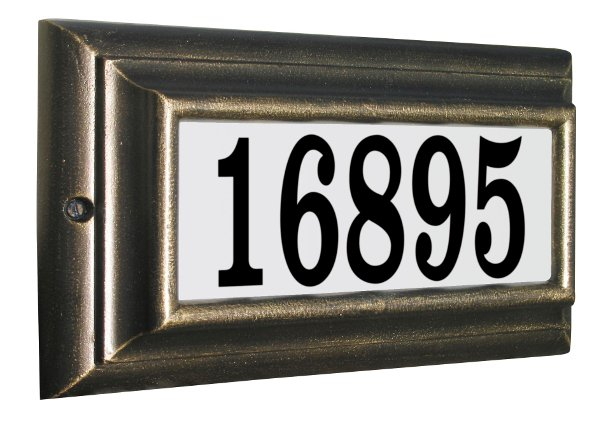
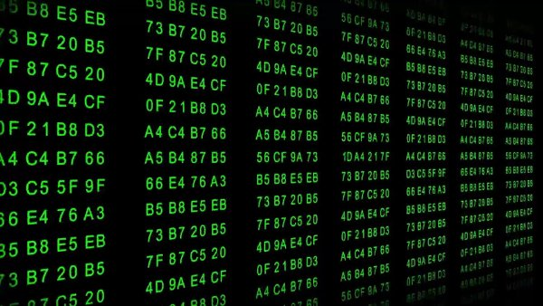
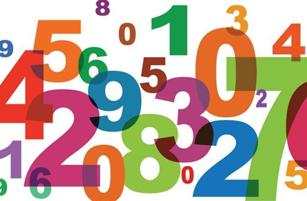
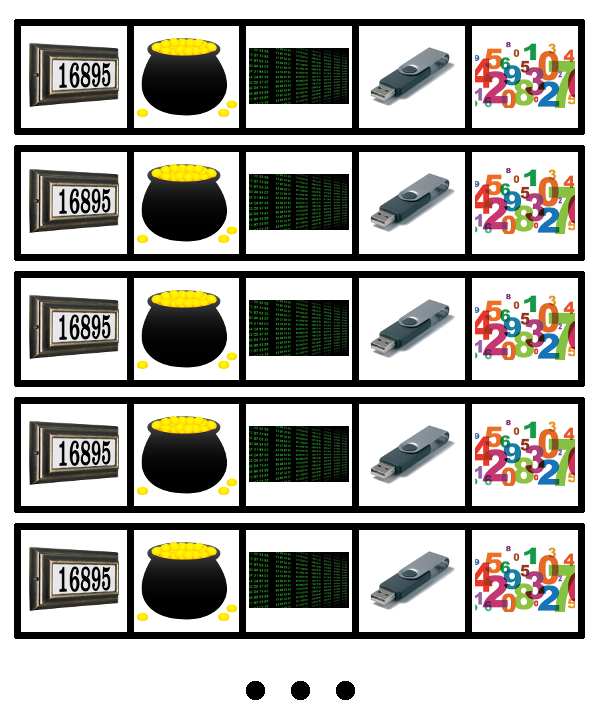
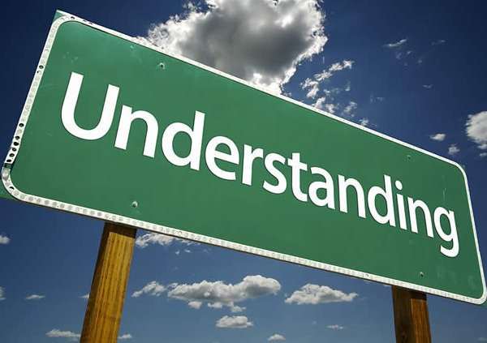

The Ethereum Classic (ETC) blockchain makes possible an unstoppable, reliable, auditable, trustless and secure world computer.  To understand this system, it is important to understand *accounts* and *states*.

# Accounts

An account is a data structure containing an address, balance, program, memory and a nonce.  They are used by entities external to the ETC system to interact with it.  These external entities may be humans, but, they can also be Internet devices.  Accounts are also used to specify smart contracts.  It simplifies the design of ETC to use accounts for both of these purposes.

### Addresses

Accounts have unique 20 byte identifiers referred to as *addresses*.  External entities generate new account addresses from public encryption keys.  Smart contracts generate new account addresses by other means since smart contract accounts do not have public encryption keys.

### Balances

Accounts can have funds.  Account funds are specified by *balances*.  Balances are typically denoted in units of aETC (10-18 ETC) or weis.

### Programs

Smart contract accounts have world computer *programs*.  These are also referred to as smart contract *code*.  This element is unused by external entity accounts.  Partially for security reasons, smart contract programs in accounts cannot be modified.  All other account elements however *can* be modified.

### Memories

Smart contract accounts have *memories*.  These are also referred to as *storage*.  All smart contract memory values, and their identifiers, are 32 bytes.

### Nonces

Accounts have counters referred to as *nonces*.  Partially to protect against replay attacks, external account nonces increment every time they add a new transaction to the blockchain.  Partially to provide variability when calculating new addresses, smart contract account nonces increment every time they add a new smart contract to the blockchain.

# States

A *complete* description of the world computer can be given solely by the accounts!  This complete description is referred to as the *state* of the world computer.  Because the world computer is always running, the state is always changing.

# Conclusion

There are external entity accounts and smart contract accounts.  They completely specify the state of the world computer at all times.  If you understand all that then you have taken a significant step in mastering ETC!

# Feedback

You can contact me by clicking any of these icons:

  

# Acknowledgements

I would like to thank IOHK (Input Output Hong Kong) for funding this effort.

# License

This work is licensed under the Creative Commons Attribution ShareAlike 4.0 International License.
